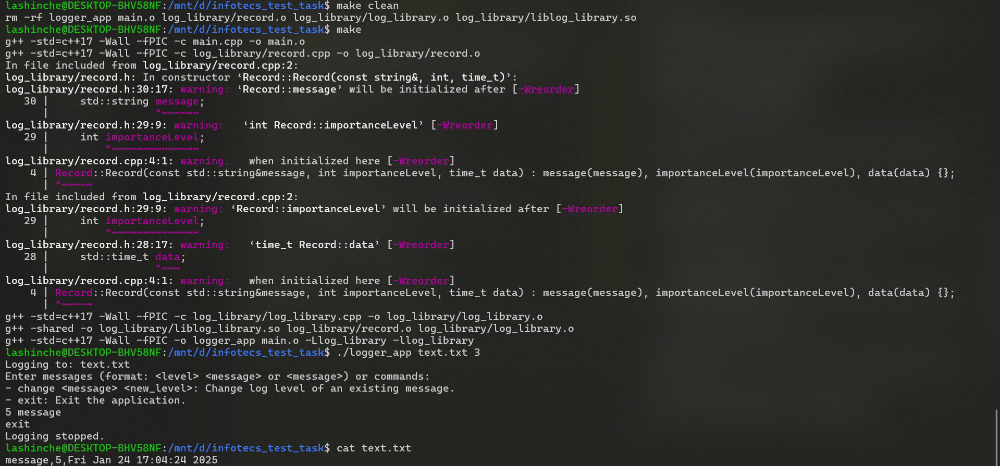
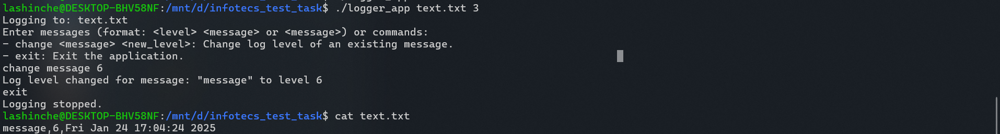

# logging_message_app
---
Logging message - приложения для записи текстовых сообщений в журнал. 
## log_library
`log_library` - код для динамической библеотеки по записи текстовых сообщений в журнал
- `log_library/record.cpp`, `log_library/record.h` - описывается класс `Record` предназначенный для хранения записей с текстом сообщения, уровнем его важности и временной меткой. Методы класса преднозначены для преобразования данных в форму CSV и чтения данных.(Формат CSV - "data,levelMessage,date")
- `log_library/log_library.cpp`, `log_library/log_library.h` - ключивым объектом является класс `Logger`, который отвечает за    управление лог-файлом(т е открытие, создание и запись). Так же публичным явлется метод `ChangeMessageLevel` при помощи которо можно менять важность записи. Приватный метод `ReadAllMessage()` возвращает все записи в векторе.

## main.cpp

Программа реализует многопоточное приложение для записи логов с использованием потокобезопасной очереди. При запуске указываются файл для логов и уровень важности по умолчанию. Основной поток обрабатывает ввод пользователя, где можно добавлять сообщения (с указанием уровня важности или без него), изменять уровень важности существующих сообщений с помощью команды change, или завершить работу, введя exit. Фоновый поток извлекает сообщения из очереди и записывает их в файл через объект Logger. Очередь синхронизирована с помощью мьютексов и условных переменных, обеспечивая безопасное взаимодействие между потоками.

# Запуск программы:
- Сбор программы и библеотеки 
```makefile
make
```
- Установка библеотеки(опционально )
```makefile
sudo make install
```
- Запуск программы (aргументы data_storage_file default_message_level)
```
./logger_app logfile.txt 1
```
- Очистите все временные файлы:
```
make clean
```
## Демонстарция работы программы 
- Вставка 
 
- Замена

